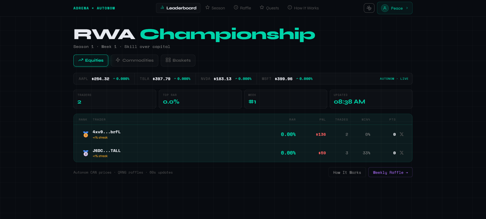
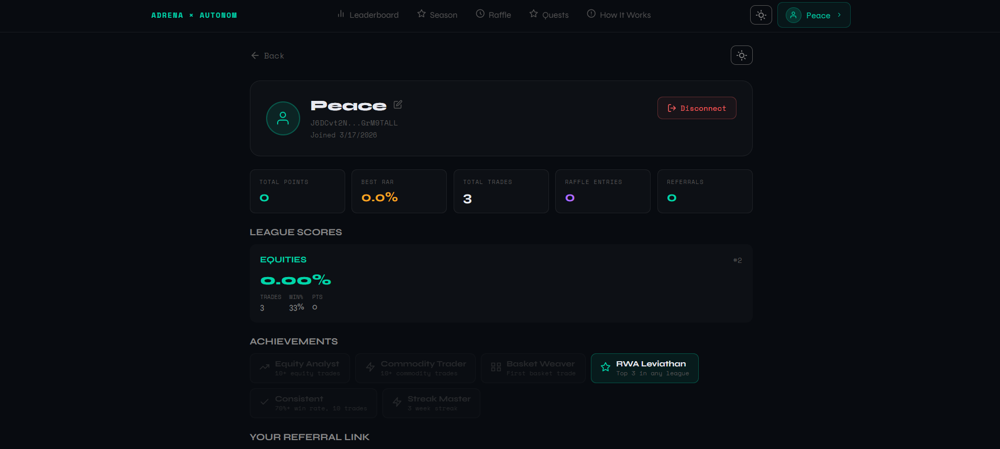
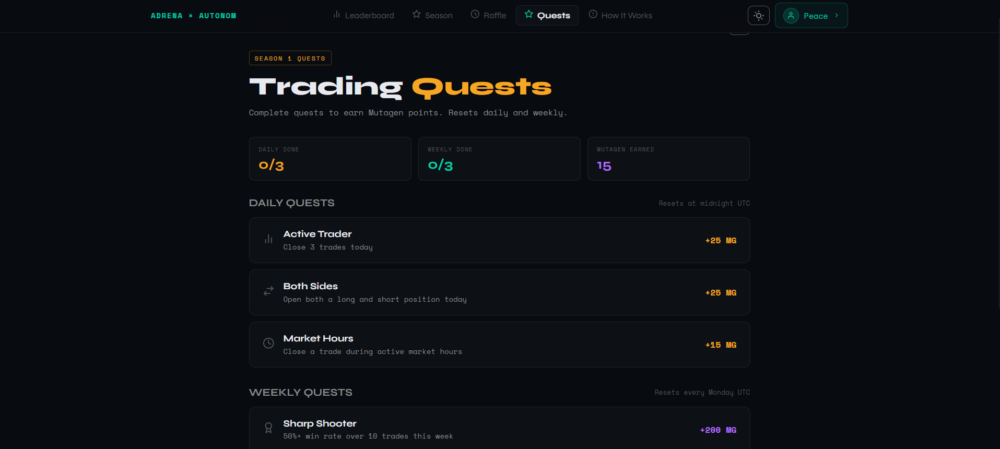
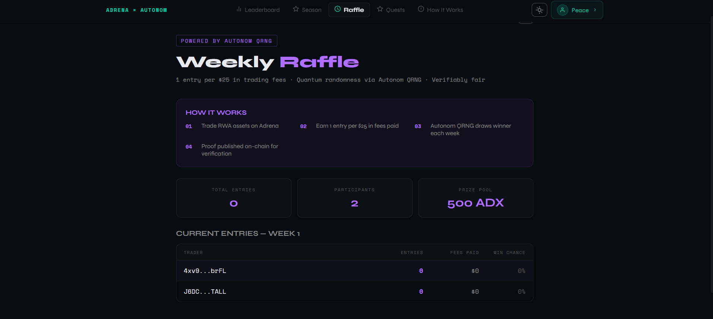
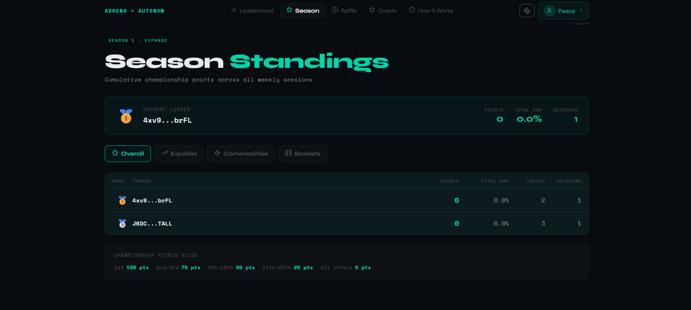
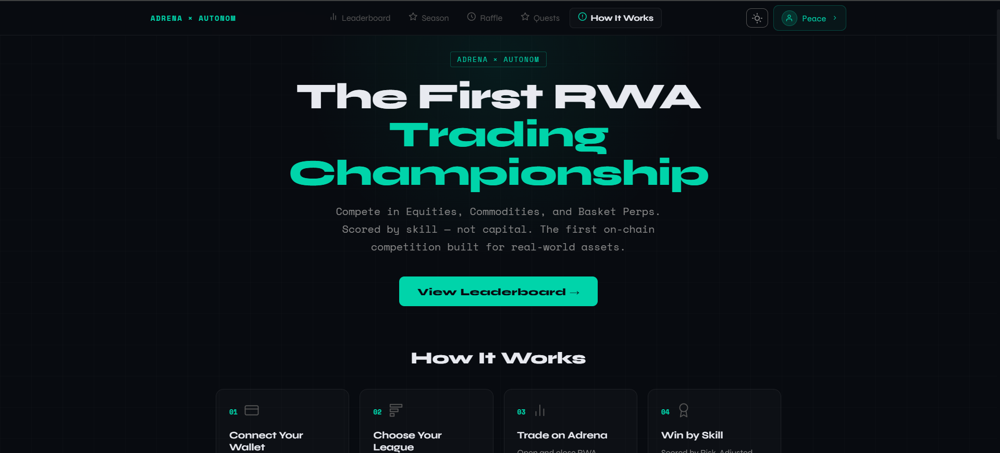
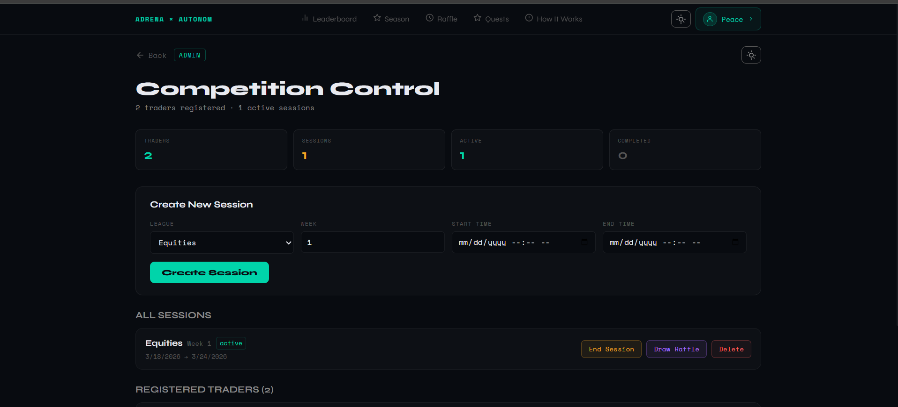

# Adrena × Autonom RWA Championship

> The first on-chain trading competition for Real-World Assets — built on Adrena perpetuals, powered by Autonom price feeds and QRNG.

**Live Demo:** https://adrena-rwa-championship.vercel.app  
**GitHub:** https://github.com/peace-dapps/adrena-rwa-championship

---

## Overview

The RWA Championship is a skill-based trading competition where traders compete across three RWA asset leagues — Equities, Commodities, and Basket Perps. Unlike standard leaderboards that reward capital size, the championship uses **Risk-Adjusted Return (RAR)** scoring so a $100 trader can beat a $10,000 trader purely on skill.

Built specifically for the Adrena × Autonom bounty, this is the only submission that fully integrates Autonom's CAN-normalized price feeds, market hours API, and QRNG raffle system.

---

## Screenshots

### Leaderboard


### Trader Profile


### Trading Quests


### Weekly Raffle


### Season Standings


### How It Works


### Admin Panel


---

## RAR Scoring Formula

```
RAR = (PnL% × Consistency Multiplier × Streak Bonus)
```

| Component | Description |
|-----------|-------------|
| PnL% | Return on collateral, normalized via Autonom CAN prices |
| Consistency | 0.5x–2.0x based on win rate over minimum 5 trades |
| Streak Bonus | +10% per consecutive week active (max 1.5x) |
| Leverage Cap | 50x maximum for scoring (anti-gaming) |
| Min Collateral | $10 per qualifying trade |
| Min Duration | 60 seconds per position |

---

## Features

- **3 Asset Class Leagues** — Equities (AAPL, TSLA, NVDA, MSFT), Commodities (Gold, Oil, Silver, NatGas), Basket Perps
- **Live Price Ticker** — Real-time Autonom CAN-normalized prices
- **RAR Leaderboard** — Weekly rankings updated every 60 seconds
- **Season Standings** — Cumulative championship points across all weeks
- **Trader Profiles** — Full trade history, achievements, league scores
- **Trading Quests** — Daily and weekly challenges with Mutagen point rewards
- **QRNG Raffle** — Weekly prize draws using Autonom quantum randomness
- **Achievements & Badges** — Equity Analyst, Commodity Trader, RWA Leviathan, and more
- **Streak Tracking** — Consecutive week bonuses for consistent traders
- **Referral System** — Earn bonus raffle entries for each trader you refer
- **Admin Panel** — Session management, raffle draws, trader oversight
- **Dark/Light Theme** — Full theme support
- **Mobile Responsive** — Optimized for all screen sizes

---

## Autonom Integration

This project uses three Autonom APIs:

| API | Endpoint | Usage |
|-----|----------|-------|
| Price Feeds | `oracle.autonom.cc/prices/batch` | CAN-normalized prices for fair PnL scoring |
| Market Hours | `oracle.autonom.cc/hours/asset/{symbol}/status` | Gate scoring to open market hours only |
| QRNG | Pending | Verifiably fair weekly raffle draws |

**Why CAN normalization matters:** When Apple does a 4:1 stock split mid-competition, raw prices would break every trader's score. Autonom's Corporate Action Normalization absorbs this automatically — no manual intervention needed.

---

## Architecture

```
┌─────────────────────────────────────────────────────┐
│                   FRONTEND (Vercel)                  │
│  Next.js 14 + React + Supabase client               │
│  Pages: Leaderboard, Profile, Quests, Raffle,       │
│         Season, Admin, How It Works                  │
└──────────────────────┬──────────────────────────────┘
                       │
                       ▼
┌─────────────────────────────────────────────────────┐
│                  SUPABASE (Database)                 │
│  Tables: traders, sessions, positions,              │
│          leaderboard_scores, season_leaderboard,    │
│          raffle_entries, raffle_results,            │
│          trader_achievements, trader_streaks,       │
│          quest_completions                          │
└──────────────────────┬──────────────────────────────┘
                       │
                       ▼
┌─────────────────────────────────────────────────────┐
│           SCORING ENGINE (VPS / pm2)                │
│  Node.js + TypeScript — polls every 60 seconds     │
│  ┌─────────────┐  ┌──────────────┐  ┌───────────┐ │
│  │ Adrena API  │  │ Autonom API  │  │ Supabase  │ │
│  │ /position   │  │ /prices/batch│  │  upsert   │ │
│  └─────────────┘  └──────────────┘  └───────────┘ │
│  Modules: scoring, raffle, achievements,           │
│           streaks, quests                          │
└─────────────────────────────────────────────────────┘
```

---

## Tech Stack

| Layer | Technology |
|-------|-----------|
| Frontend | Next.js 14, React, TypeScript |
| Database | Supabase (PostgreSQL) |
| Scoring Engine | Node.js, TypeScript, pm2 |
| Hosting | Vercel (frontend), VPS AlmaLinux 9 (engine) |
| Price Feeds | Autonom CAN API |
| Market Hours | Autonom Hours API |
| Position Data | Adrena Public API |
| Wallet Auth | Phantom wallet + message signing |

---

## Deployment Guide

### Prerequisites

- Node.js 18+
- Supabase account
- Vercel account
- VPS with Node.js (for scoring engine)
- Phantom wallet

### 1. Clone the Repository

```bash
git clone https://github.com/peace-dapps/adrena-rwa-championship
cd adrena-rwa-championship
```

### 2. Set Up Supabase

1. Create a new Supabase project
2. Run the schema file in SQL Editor:
```bash
# Copy contents of rwa-championship/schema.sql
# Paste and run in Supabase SQL Editor
```
3. Run the quest migration:
```sql
CREATE TABLE IF NOT EXISTS quest_completions (
  id uuid PRIMARY KEY DEFAULT gen_random_uuid(),
  wallet_address text NOT NULL,
  quest_key text NOT NULL,
  quest_name text NOT NULL,
  quest_type text NOT NULL,
  reward_mutagen int DEFAULT 0,
  session_id uuid REFERENCES sessions(id),
  completed_at timestamptz DEFAULT now()
);
```
4. Copy your Supabase URL and keys

### 3. Deploy Frontend to Vercel

1. Push repo to GitHub
2. Import project in Vercel
3. Set root directory to `rwa-championship/frontend`
4. Add environment variables:

```env
NEXT_PUBLIC_SUPABASE_URL=your_supabase_url
NEXT_PUBLIC_SUPABASE_ANON_KEY=your_anon_key
NEXT_PUBLIC_ADMIN_PASSWORD=your_admin_password
```

5. Deploy

### 4. Deploy Scoring Engine to VPS

```bash
# SSH into your VPS
ssh root@your-vps-ip

# Clone repo
git clone https://github.com/peace-dapps/adrena-rwa-championship
cd adrena-rwa-championship/rwa-championship/scoring-engine

# Install dependencies
npm install

# Create .env file
cat > .env << EOF
SUPABASE_URL=your_supabase_url
SUPABASE_SERVICE_KEY=your_service_role_key
AUTONOM_API_KEY=your_autonom_api_key
EOF

# Build
npm run build

# Start with pm2
pm2 start dist/index.js --name rwa-scoring-engine
pm2 save
pm2 startup
```

### 5. Create First Season and Session

1. Visit `your-site.vercel.app/admin`
2. Enter admin password
3. Create a new session:
   - League: Equities (or Commodities or Baskets)
   - Week: 1
   - Start/End time: your competition window
4. Click Activate

---

## Environment Variables

### Frontend (Vercel)

| Variable | Description |
|----------|-------------|
| `NEXT_PUBLIC_SUPABASE_URL` | Supabase project URL |
| `NEXT_PUBLIC_SUPABASE_ANON_KEY` | Supabase anon key |
| `NEXT_PUBLIC_ADMIN_PASSWORD` | Admin panel password |

### Scoring Engine (VPS)

| Variable | Description |
|----------|-------------|
| `SUPABASE_URL` | Supabase project URL |
| `SUPABASE_SERVICE_KEY` | Supabase service role key |
| `AUTONOM_API_KEY` | Autonom API key for price feeds |

---

## Scoring Engine Commands

```bash
# View logs
pm2 logs rwa-scoring-engine

# Restart
pm2 restart rwa-scoring-engine

# Stop
pm2 stop rwa-scoring-engine

# Monitor
pm2 monit
```

---

## Database Schema

10 tables covering the full competition lifecycle:

- `seasons` — Season metadata and status
- `sessions` — Weekly competition windows per league
- `traders` — Registered wallets with display names
- `positions` — All scored trading positions from Adrena
- `leaderboard_scores` — Weekly RAR scores per trader per league
- `season_leaderboard` — Cross-week championship points
- `raffle_entries` — Entries earned through trading fees
- `raffle_results` — QRNG-drawn weekly winners
- `trader_achievements` — Unlocked achievement badges
- `trader_streaks` — Consecutive week tracking
- `quest_completions` — Daily/weekly quest progress

---

## Bounty Submission

**Bounty:** Superteam Ireland — Adrena × Autonom RWA Championship  
**Submitted by:** peace_onchain  
**Deadline:** April 8, 2026

### What makes this different from other submissions:

1. **Only submission using Autonom** — Live API key, real CAN price feeds, market hours gating
2. **RWA-specific design** — Built for equities, commodities, and basket perps — not just BTC/SOL
3. **RAR scoring** — Rewards skill over capital, solving Adrena's "Be Equitable" core value
4. **Full feature set** — Leaderboard, profiles, quests, streaks, achievements, raffle, referrals, season standings, admin panel
5. **Production-ready** — Live scoring engine on VPS, real database, real wallet auth

---

## License

MIT
